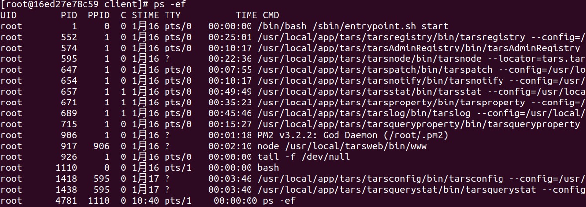
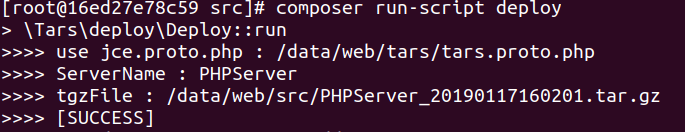
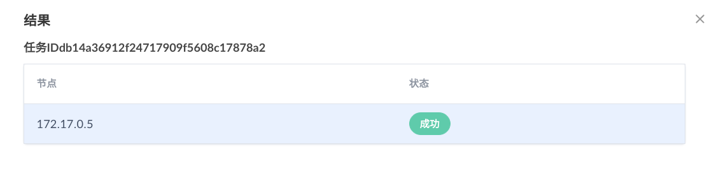
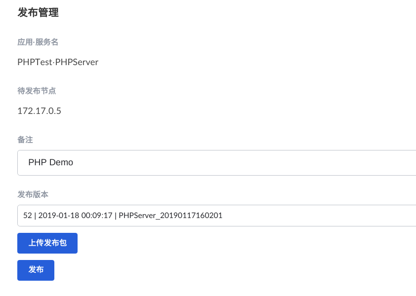
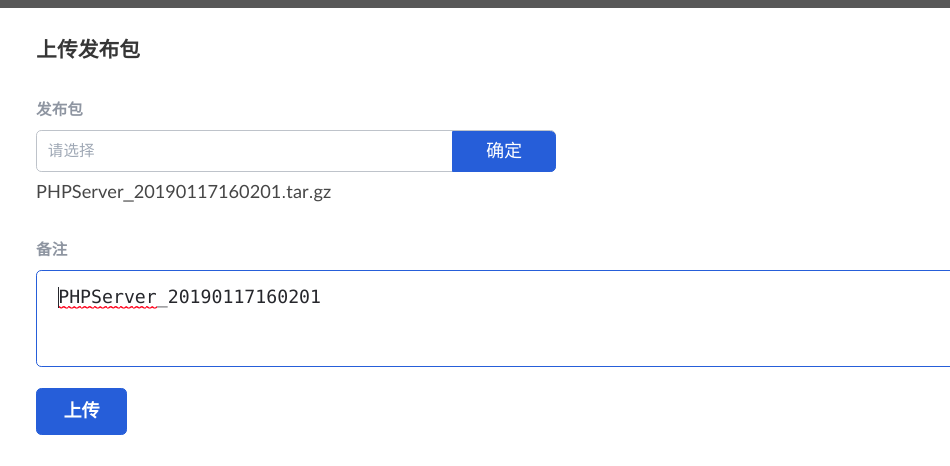
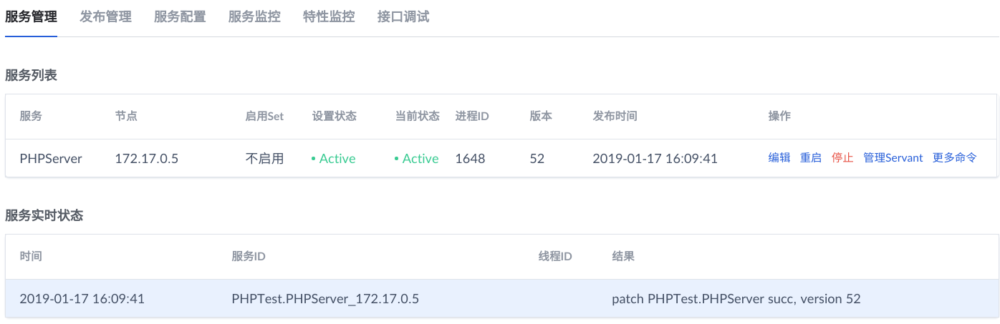
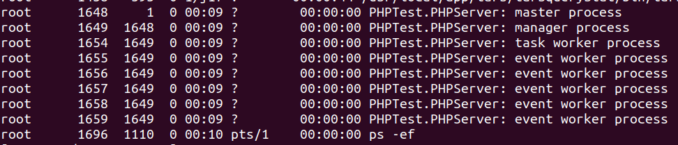
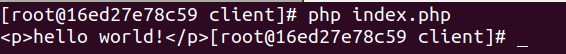

## Tars PHP Demo

### 目录结构

| 目录      | 文件                   | 作用                     | 备注              |
| ------- | -------------------- | ---------------------- | --------------- |
| scripts | tars2php.sh          | 根据tars.proto.php生成代码配置 | 优化路径问题，任意目录执行   |
| src     |                      |                        | 服务端开发目录         |
|         | conf/ENVConf.php     | 环境变量，配置文件              |                 |
|         | impl/                | 自动生成的测试代码              |                 |
|         | servant/             | PHPTest测试代码            |                 |
|         | index.php            | 命令行执行文件                |                 |
| tars    | tars.proto.php       | tars自动生成配置文件           |                 |
|         | test.tars            | tars协议文件               |                 |
| client  |                      |                        | 客户端开发目录         |
|         | PHPTest/             | PHPTest测试代码            |                 |
|         | index.php            | 命令行执行文件                |                 |
|         | tarsclient.proto     | tars自动生成配置文件           |                 |
|         | test.tars            | tars协议文件               |                 |
| docs    |                      |                        |                 |
|         | images/              | 相关Web管理服务截图            |                 |
|         | tars.tarsstat.md     | tarsstat服务模板           | 修改兼容MySQL5.7的语句 |
|         | tars.tarsstat.old    |                        |                 |
|         | tars.property        | tarsproperty服务模板       | 修改兼容MySQL5.7的语句 |
|         | tars.property.old.md |                        |                 |

### 相关截图

在docker内查看相关的服务

```
ps -ef
```



打包文件

```
composer run-script deploy
```



服务部署


服务部署成功，回到主页，刷新即可看到PHPTest。



发布管理



上传发布包



服务端状态查看



查看PHP服务运行状态



执行测试文件

```
cd client
php index.php
```



### 参考链接

1. [TARS PHP TCP服务端与客户端开发](https://tangramor.gitlab.io/tars-docker-guide/2.TARS-PHP-TCP%E6%9C%8D%E5%8A%A1%E7%AB%AF%E4%B8%8E%E5%AE%A2%E6%88%B7%E7%AB%AF%E5%BC%80%E5%8F%91/)